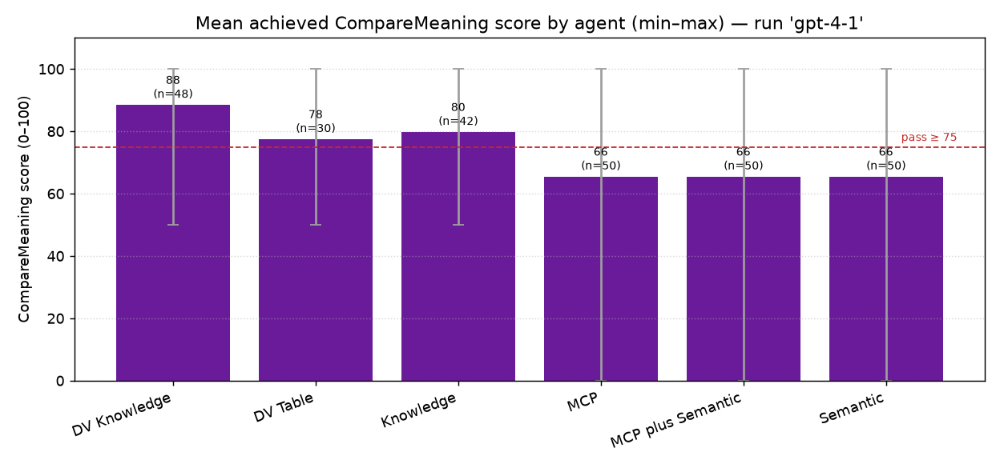
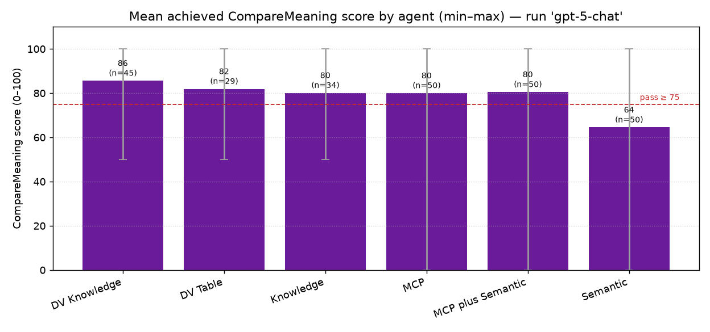
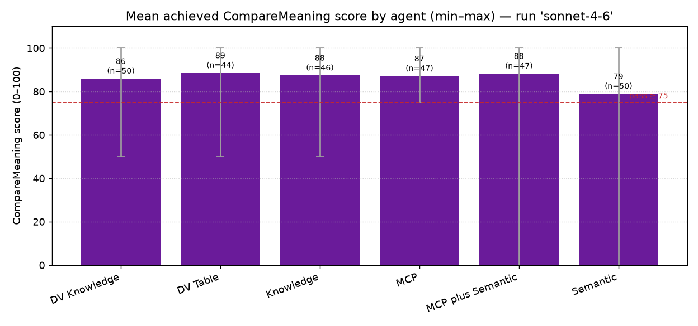

# Evaluation Results — Static Analysis

_Generated 2026-06-30T17:36:30 from `data/eval/results`._

Runs analyzed: **3** · agents seen: **6** · eval methods: `CompareMeaning`, `GeneralQuality`.

**Pass/fail scoring uses the `CompareMeaning` method only**; other methods are reported per-method for reference but do not affect the headline pass rate, the passed/failed counts, or the failing-question analysis.

**Pass threshold (PASSING_SCORE).** A case passes when its achieved `CompareMeaning` score (0–100) is **≥ 75** (inclusive). Pass/fail is derived from the achieved score, not the grader's own verdict; the mean/min/max achieved score per agent is charted and tabled below.

**Errors (timeouts).** Cases where the agent returned nothing to grade (empty response) are counted as errors, shown in the absolute counts, but excluded from the pass-rate denominator — pass rate = passed / (passed + failed), errors not in the divisor.

This report restates the numbers in the result files; it draws no conclusions. Note that agents do not all share the same case count, so pass rates compare proportions over different sample sizes.

## Across runs

| Agent | gpt-4-1 | gpt-5-chat | sonnet-4-6 |
|---|---|---|---|
| MultiEURLEX Classic DV Knowledge | 94.0% (47/50) | 88.0% (44/50) | 98.0% (49/50) |
| MultiEURLEX Classic DV Table | 52.0% (26/50) | 56.0% (28/50) | 91.5% (43/47) +3E |
| MultiEURLEX Classic Knowledge | 66.0% (33/50) | 58.0% (29/50) | 95.7% (45/47) +3E |
| MultiEURLEX Classic MCP | 68.0% (34/50) | 94.0% (47/50) | 100.0% (47/47) +3E |
| MultiEURLEX Classic MCP plus Semantic | 70.0% (35/50) | 86.0% (43/50) | 97.9% (46/47) +3E |
| MultiEURLEX Classic Semantic | 72.0% (36/50) | 68.0% (34/50) | 88.0% (44/50) |

## Run: gpt-4-1

_generated `2026-06-30T15:36:19.714703+00:00` · source `data/eval/results/gpt-4-1/summary.json`_

| Agent | Cases | Passed (CompareMeaning) | Failed | Errors | Pass rate | Score (mean/min) | CompareMeaning | GeneralQuality |
|---|---|---|---|---|---|---|---|---|
| MultiEURLEX Classic DV Knowledge | 50 | 47 | 3 | 0 | 94.0% | 88/50 | 94.0% (47/50) | 94.0% (47/50) |
| MultiEURLEX Classic DV Table | 50 | 26 | 24 | 0 | 52.0% | 78/50 | 52.0% (26/50) | 54.0% (27/50) |
| MultiEURLEX Classic Knowledge | 50 | 33 | 17 | 0 | 66.0% | 80/50 | 66.0% (33/50) | 80.0% (40/50) |
| MultiEURLEX Classic MCP | 50 | 34 | 16 | 0 | 68.0% | 66/0 | 68.0% (34/50) | 78.0% (39/50) |
| MultiEURLEX Classic MCP plus Semantic | 50 | 35 | 15 | 0 | 70.0% | 66/0 | 70.0% (35/50) | 74.0% (37/50) |
| MultiEURLEX Classic Semantic | 50 | 36 | 14 | 0 | 72.0% | 66/0 | 72.0% (36/50) | 72.0% (36/50) |

**Agents with no result in this run:** MultiEURLEX Classic SharePoint.

### Top 10 failing questions

Ranked by number of agents whose `CompareMeaning` check failed (then by errors). Errors (timeouts) are listed separately and are not counted as failures.

| # | Question | Asked by | Failed | Failing agents | Errored agents |
|---|---|---|---|---|---|
| 1 | Which act in the corpus sets out the data subject's right to erasure (the 'right to be fo… | 6 | 6/6 | DV Knowledge, DV Table, Knowledge, MCP, MCP plus Semantic, Semantic | — |
| 2 | Which 2013 Commission Directive in the Law domain amends Annex III to the rail interopera… | 6 | 4/6 | DV Table, MCP, MCP plus Semantic, Semantic | — |
| 3 | Which 2013 Council Directive (Euratom) in the Science domain lays down requirements prote… | 6 | 4/6 | DV Table, Knowledge, MCP, Semantic | — |
| 4 | Which EU act sets the permitted upper limits for traces of crop-treatment chemicals left … | 6 | 4/6 | DV Table, Knowledge, MCP, MCP plus Semantic | — |
| 5 | Which 2015 EU directive updates the rules on the dockside facilities that take in rubbish… | 6 | 4/6 | Knowledge, MCP, MCP plus Semantic, Semantic | — |
| 6 | Which 2015 EU directive sets a maximum permitted level for a foam-forming chemical in the… | 6 | 4/6 | Knowledge, MCP, MCP plus Semantic, Semantic | — |
| 7 | Which EU act includes pyriproxyfen as an active substance for biocidal products, and whic… | 6 | 3/6 | Knowledge, MCP plus Semantic, Semantic | — |
| 8 | Which EU regulation lays down the model for operational programmes under the Investment f… | 6 | 3/6 | DV Table, Knowledge, MCP | — |
| 9 | Which 2015 Directive amends Directive 94/62/EC to reduce the consumption of lightweight p… | 6 | 3/6 | DV Knowledge, DV Table, MCP | — |
| 10 | In the 2015 European Central Bank Decision on targeted longer-term refinancing operations… | 6 | 3/6 | DV Table, MCP, MCP plus Semantic | — |

## Run: gpt-5-chat

_generated `2026-06-30T15:36:19.735173+00:00` · source `data/eval/results/gpt-5-chat/summary.json`_

| Agent | Cases | Passed (CompareMeaning) | Failed | Errors | Pass rate | Score (mean/min) | CompareMeaning | GeneralQuality |
|---|---|---|---|---|---|---|---|---|
| MultiEURLEX Classic DV Knowledge | 50 | 44 | 6 | 0 | 88.0% | 86/50 | 88.0% (44/50) | 84.0% (42/50) |
| MultiEURLEX Classic DV Table | 50 | 28 | 22 | 0 | 56.0% | 82/50 | 56.0% (28/50) | 52.0% (26/50) |
| MultiEURLEX Classic Knowledge | 50 | 29 | 21 | 0 | 58.0% | 80/50 | 58.0% (29/50) | 64.0% (32/50) |
| MultiEURLEX Classic MCP | 50 | 47 | 3 | 0 | 94.0% | 80/0 | 94.0% (47/50) | 84.0% (42/50) |
| MultiEURLEX Classic MCP plus Semantic | 50 | 43 | 7 | 0 | 86.0% | 80/0 | 86.0% (43/50) | 80.0% (40/50) |
| MultiEURLEX Classic Semantic | 50 | 34 | 16 | 0 | 68.0% | 64/0 | 68.0% (34/50) | 66.0% (33/50) |

**Agents with no result in this run:** MultiEURLEX Classic SharePoint.

### Top 10 failing questions

Ranked by number of agents whose `CompareMeaning` check failed (then by errors). Errors (timeouts) are listed separately and are not counted as failures.

| # | Question | Asked by | Failed | Failing agents | Errored agents |
|---|---|---|---|---|---|
| 1 | Which EU act sets maximum residue levels for pesticides such as acetamiprid and tebuconaz… | 6 | 4/6 | DV Table, MCP, MCP plus Semantic, Semantic | — |
| 2 | Which act in the corpus sets out the data subject's right to erasure (the 'right to be fo… | 6 | 4/6 | DV Knowledge, DV Table, Knowledge, MCP plus Semantic | — |
| 3 | Which EU act includes pyriproxyfen as an active substance for biocidal products, and whic… | 6 | 3/6 | DV Table, MCP plus Semantic, Semantic | — |
| 4 | Which 2013 Council Regulation in the employment and working conditions domain lays down t… | 6 | 3/6 | DV Knowledge, DV Table, Knowledge | — |
| 5 | A 2014 Commission Regulation in the Energy domain defines the criteria and geographic ran… | 6 | 3/6 | DV Knowledge, Knowledge, Semantic | — |
| 6 | Which 2015 Directive amends Directive 94/62/EC to reduce the consumption of lightweight p… | 6 | 3/6 | DV Knowledge, DV Table, Knowledge | — |
| 7 | Two of the EU-third country Association Council decisions (EU, Euratom) establishing Sub-… | 6 | 3/6 | DV Table, Knowledge, Semantic | — |
| 8 | Which 2015 Council Directive in the Finance domain adds a common minimum anti-abuse rule … | 6 | 3/6 | DV Knowledge, DV Table, Knowledge | — |
| 9 | Which 2015 CFSP Decision appoints the European Union Special Representative for Central A… | 6 | 3/6 | DV Table, Knowledge, Semantic | — |
| 10 | Which 2015 EU directive sets a maximum permitted level for a foam-forming chemical in the… | 6 | 3/6 | Knowledge, MCP plus Semantic, Semantic | — |

## Run: sonnet-4-6

_generated `2026-06-30T15:36:19.761463+00:00` · source `data/eval/results/sonnet-4-6/summary.json`_

| Agent | Cases | Passed (CompareMeaning) | Failed | Errors | Pass rate | Score (mean/min) | CompareMeaning | GeneralQuality |
|---|---|---|---|---|---|---|---|---|
| MultiEURLEX Classic DV Knowledge | 50 | 49 | 1 | 0 | 98.0% | 86/50 | 98.0% (49/50) | 90.0% (45/50) |
| MultiEURLEX Classic DV Table | 50 | 43 | 4 | 3 | 91.5% | 89/50 | 91.5% (43/47) +3E | 76.6% (36/47) +3E |
| MultiEURLEX Classic Knowledge | 50 | 45 | 2 | 3 | 95.7% | 88/50 | 95.7% (45/47) +3E | 93.6% (44/47) +3E |
| MultiEURLEX Classic MCP | 50 | 47 | 0 | 3 | 100.0% | 87/75 | 100.0% (47/47) +3E | 91.5% (43/47) +3E |
| MultiEURLEX Classic MCP plus Semantic | 50 | 46 | 1 | 3 | 97.9% | 88/0 | 97.9% (46/47) +3E | 93.6% (44/47) +3E |
| MultiEURLEX Classic Semantic | 50 | 44 | 6 | 0 | 88.0% | 79/0 | 88.0% (44/50) | 84.0% (42/50) |

**Agents with no result in this run:** MultiEURLEX Classic SharePoint.

### Top 10 failing questions

Ranked by number of agents whose `CompareMeaning` check failed (then by errors). Errors (timeouts) are listed separately and are not counted as failures.

| # | Question | Asked by | Failed | Failing agents | Errored agents |
|---|---|---|---|---|---|
| 1 | Which EU act sets the permitted upper limits for traces of crop-treatment chemicals left … | 6 | 4/6 | DV Knowledge, DV Table, Knowledge, Semantic | MCP, MCP plus Semantic |
| 2 | Which act in the corpus sets out the data subject's right to erasure (the 'right to be fo… | 6 | 2/6 | DV Table, Knowledge | — |
| 3 | Among the Directives that add active substances to the biocidal products Directive 98/8/E… | 6 | 1/6 | Semantic | DV Table, MCP plus Semantic |
| 4 | Which 2015 EU directive sets a maximum permitted level for a foam-forming chemical in the… | 6 | 1/6 | Semantic | Knowledge |
| 5 | Which 2014 EU Regulation lays down the rules on the information that Member States must s… | 6 | 1/6 | Semantic | — |
| 6 | Which 2015 Council Directive in the Finance domain adds a common minimum anti-abuse rule … | 6 | 1/6 | DV Table | — |
| 7 | Which 2014 Regulation in the Transport domain amends the EU Emissions Trading System Dire… | 6 | 1/6 | DV Table | — |
| 8 | Which 2014 Regulation amends Regulation (EC) No 539/2001 on the visa lists, and which thi… | 6 | 1/6 | Semantic | — |
| 9 | Which EU directive aims to cut down how many flimsy throwaway shopping sacks each person … | 6 | 1/6 | MCP plus Semantic | — |
| 10 | Which EU directive revises the safeguards that keep underground water sources from becomi… | 6 | 1/6 | Semantic | — |
