# Knowledge Retrieval Methods for Copilot Studio Agents

_MultiEURLEX legal-document corpus · Evaluation results generated 30 June 2026_

---

## Executive Summary

This evaluation compares six retrieval configurations for a Copilot Studio agent
answering questions over a 300-document corpus of EU legal texts. The same
question set, corpus, instructions, and grading method were used across three
model runs: **GPT-4.1**, **GPT-5 Chat**, and **Claude Sonnet 4.6**.

The headline metric is the **CompareMeaning** pass rate. `GeneralQuality` is
reported separately for context, but it does not affect the pass/fail counts or
the failing-question analysis. Empty responses and timeouts are counted as
errors and excluded from the pass-rate denominator.

Three findings stand out:

1. **Model choice changes the ranking of retrieval methods.** GPT-4.1 favoured
   per-document uploaded knowledge (**DV Knowledge**, 96.0%), while GPT-5 Chat
   favoured structured Dataverse MCP retrieval (**MCP**, 96.0%) and the hybrid
   MCP plus Semantic method (92.0%). Sonnet 4.6 pushed four methods to at least
   97.9% and two methods to 100.0%.

2. **Native Dataverse table knowledge is the weakest method on the two GPT
   runs.** DV Table scored **60.0%** on GPT-4.1 and **58.0%** on GPT-5 Chat. It
   improved sharply on Sonnet 4.6 to **93.6%**, but with three timeout/error
   cases.

3. **Stronger models compress retrieval differences but do not remove
   operational risk.** Sonnet 4.6 narrowed the scored pass-rate spread to 10
   points, from 36 points on GPT-4.1 and 38 points on GPT-5 Chat. However, four
   Sonnet configurations produced three empty-response/timeouts each, so the
   highest accuracy figures should be read together with the error counts.

**Engineering guidance:** for metadata-rich legal and policy corpora, use
structured MCP retrieval as the default when tools are available; use the hybrid
method when Dataverse semantic-search recall is worth the added execution cost;
if using native knowledge grounding, prefer one uploaded file per document over
a single corpus file or a connected Dataverse table.

---

## Evaluation Design

### Corpus

The evaluation uses a curated, reproducible slice of **MultiEURLEX**:

- **300 English-language EU legal documents**, each with a unique CELEX id and
  full document text.
- Document types: Regulation, Decision, and Directive.
- Years: 2012-2015.
- Document length: roughly 2-10 pages.
- Metadata dimensions: policy domain, document type, year band, legal actor
  type, and applicable role.

The metadata columns are stored as plain text so structured retrieval paths can
apply readable filters such as `policy_domain LIKE '%Finance%'` rather than
opaque choice values.

### Question Set

The test set contains **50 questions** generated from the actual corpus. Every
grounded expected answer traces to a real source document by CELEX id. The set
spans six capability tiers:

| Tier | Count | Purpose                                                         |
| ---- | ----: | --------------------------------------------------------------- |
| A    |     9 | Broad topical questions with few metadata cues                  |
| B    |    11 | Medium metadata constraints such as year and domain             |
| C    |     8 | Precise questions with 3+ constraints and exact facts           |
| D    |     7 | Tricky distractor cases where several documents look plausible  |
| E    |     5 | Unanswerable/control questions that require abstention          |
| S    |    10 | Semantic paraphrase questions with little or no lexical overlap |

The source files for the evaluation set live under `data/eval/`. The source of
truth is `multieurlex_eval_set_source.csv`; the Copilot Studio import files are
generated from the same source table.

### Retrieval Configurations

The six agents represent six ways to expose the same underlying corpus to the
agent:

| Agent                 | Retrieval mechanism                                                              | Tools                           |
| --------------------- | -------------------------------------------------------------------------------- | ------------------------------- |
| **MCP**               | Dataverse MCP `read_query`, using metadata filters plus keyword/synonym matching | Dataverse MCP                   |
| **Semantic**          | Single natural-language query to Dataverse semantic search via a Copilot Studio tool | Dataverse Semantic Search tool |
| **MCP plus Semantic** | Runs MCP and Dataverse semantic-search tool retrieval, unions results, then re-ranks | Dataverse MCP + Dataverse Semantic Search tool |
| **Knowledge**         | Whole corpus uploaded as one CSV file to a Copilot Studio knowledge source       | none                            |
| **DV Knowledge**      | Each document uploaded individually as a knowledge file                          | none                            |
| **DV Table**          | Dataverse table connected directly as a native knowledge source                  | none                            |

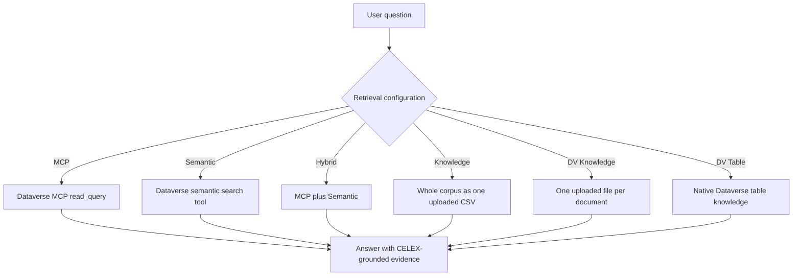

### Scoring

Pass/fail scoring uses **CompareMeaning** only. This grader checks whether the
agent answer means the same thing as the expected answer, which is the cleanest
available signal for retrieval correctness.

`GeneralQuality` is still reported because it is useful for answer-form quality,
but it is not the headline metric. It can penalise presentation, citation
format, or abstention style even when retrieval found the right content.

Errors are empty responses or timeouts. They are counted in the absolute totals
but excluded from the pass-rate denominator:

$$
\text{pass rate} = \frac{\text{passed}}{\text{passed} + \text{failed}}
$$

---

## Results Across Runs

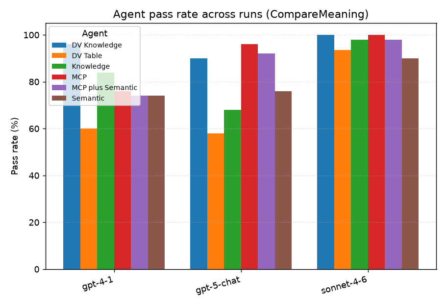

| Agent             |       GPT-4.1 |    GPT-5 Chat |         Sonnet 4.6 |
| ----------------- | ------------: | ------------: | -----------------: |
| DV Knowledge      | 96.0% (48/50) | 90.0% (45/50) |     100.0% (50/50) |
| DV Table          | 60.0% (30/50) | 58.0% (29/50) |  93.6% (44/47) +3E |
| Knowledge         | 84.0% (42/50) | 68.0% (34/50) |  97.9% (46/47) +3E |
| MCP               | 76.0% (38/50) | 96.0% (48/50) | 100.0% (47/47) +3E |
| MCP plus Semantic | 74.0% (37/50) | 92.0% (46/50) |  97.9% (46/47) +3E |
| Semantic          | 74.0% (37/50) | 76.0% (38/50) |      90.0% (45/50) |

The cross-run view shows that retrieval method and model are not independent.
DV Knowledge is strongest on GPT-4.1, MCP is strongest on GPT-5 Chat, and Sonnet
4.6 raises nearly every method above 90%. DV Table is the consistent low point
on both GPT runs, while Semantic is stable but not leading.

The model-level spreads are:

| Run        | Highest scored pass rate | Lowest scored pass rate |      Spread |
| ---------- | -----------------------: | ----------------------: | ----------: |
| GPT-4.1    |                    96.0% |                   60.0% | 36.0 points |
| GPT-5 Chat |                    96.0% |                   58.0% | 38.0 points |
| Sonnet 4.6 |                   100.0% |                   90.0% | 10.0 points |

Sonnet 4.6 clearly lifts the floor, but its error profile matters: DV Table,
Knowledge, MCP, and MCP plus Semantic each have three error cases in that run.

---

## GPT-4.1

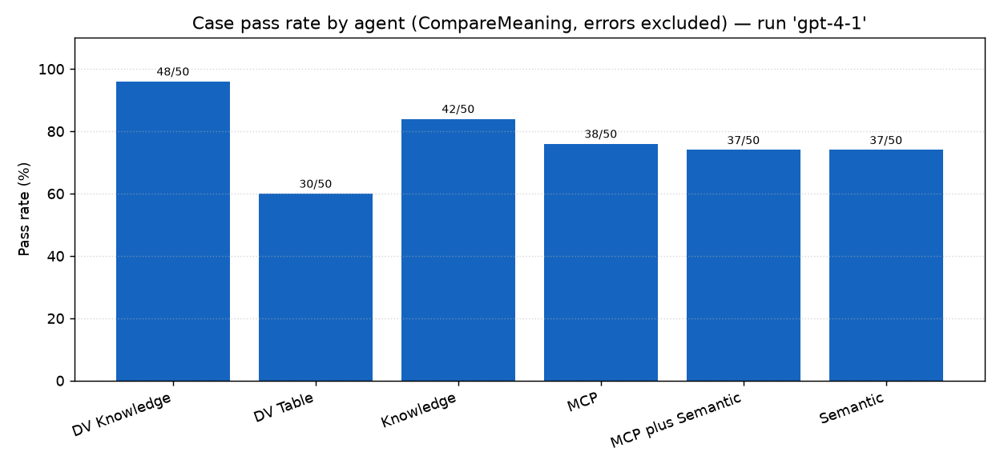

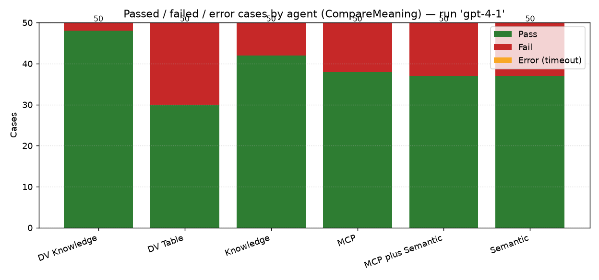

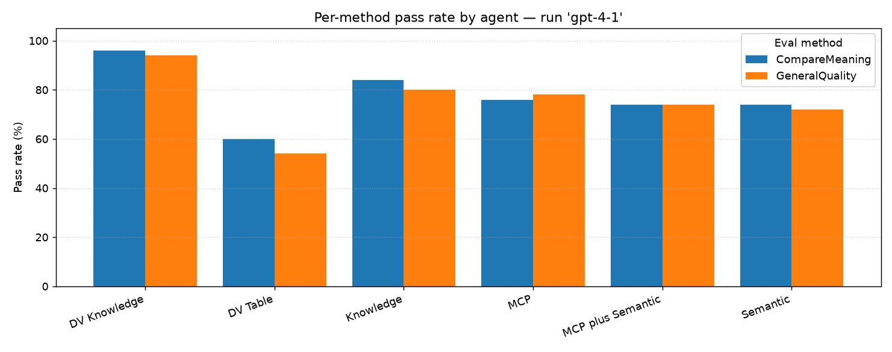

| Agent             | Cases | Passed | Failed | Errors | CompareMeaning | GeneralQuality |
| ----------------- | ----: | -----: | -----: | -----: | -------------: | -------------: |
| DV Knowledge      |    50 |     48 |      2 |      0 |  96.0% (48/50) |  94.0% (47/50) |
| DV Table          |    50 |     30 |     20 |      0 |  60.0% (30/50) |  54.0% (27/50) |
| Knowledge         |    50 |     42 |      8 |      0 |  84.0% (42/50) |  80.0% (40/50) |
| MCP               |    50 |     38 |     12 |      0 |  76.0% (38/50) |  78.0% (39/50) |
| MCP plus Semantic |    50 |     37 |     13 |      0 |  74.0% (37/50) |  74.0% (37/50) |
| Semantic          |    50 |     37 |     13 |      0 |  74.0% (37/50) |  72.0% (36/50) |

GPT-4.1 strongly favours the per-document uploaded knowledge approach. DV
Knowledge leads by 12 points over the next-best method, Knowledge, and by 20
points over MCP. DV Table is the weakest configuration by a wide margin.

The top failing-question heatmap shows one question failed by all six agents:
the corpus act that sets out the data subject's right to erasure. Several other
failures cluster around precise legal-subject distinctions, including a 2015
directive on a foam-forming chemical, pyriproxyfen as a biocidal active
substance, and rail interoperability amendments.

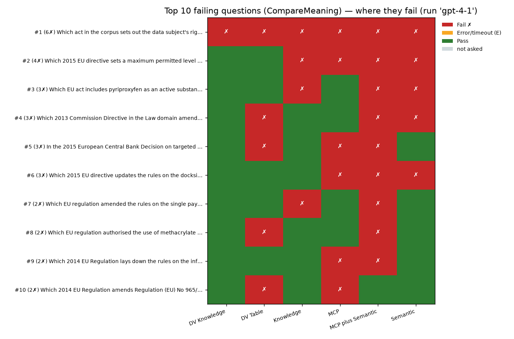

---

## GPT-5 Chat

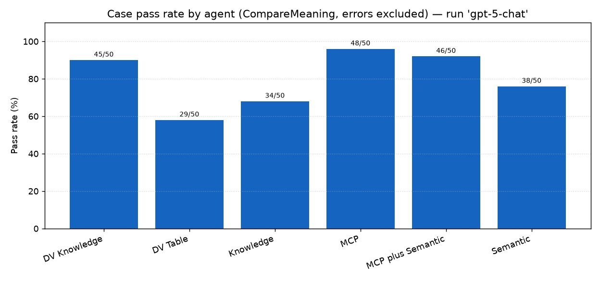

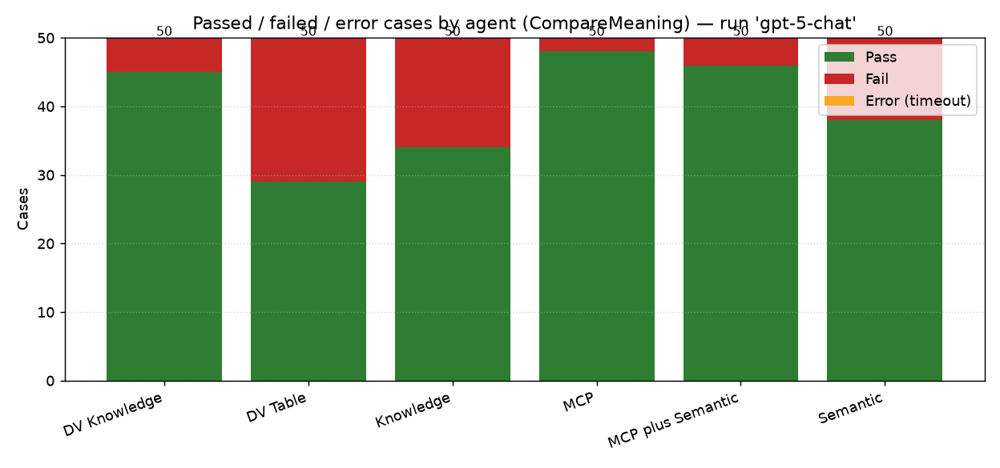

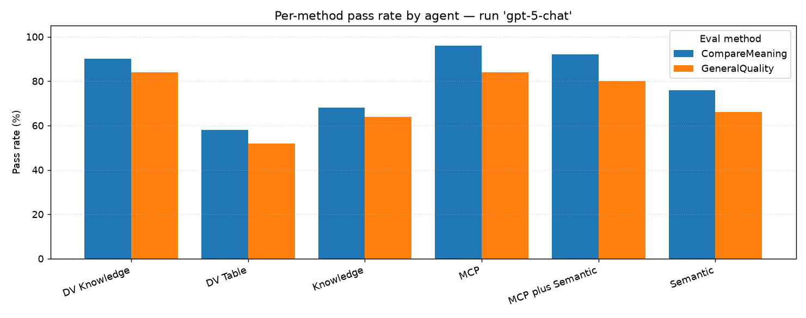

| Agent             | Cases | Passed | Failed | Errors | CompareMeaning | GeneralQuality |
| ----------------- | ----: | -----: | -----: | -----: | -------------: | -------------: |
| DV Knowledge      |    50 |     45 |      5 |      0 |  90.0% (45/50) |  84.0% (42/50) |
| DV Table          |    50 |     29 |     21 |      0 |  58.0% (29/50) |  52.0% (26/50) |
| Knowledge         |    50 |     34 |     16 |      0 |  68.0% (34/50) |  64.0% (32/50) |
| MCP               |    50 |     48 |      2 |      0 |  96.0% (48/50) |  84.0% (42/50) |
| MCP plus Semantic |    50 |     46 |      4 |      0 |  92.0% (46/50) |  80.0% (40/50) |
| Semantic          |    50 |     38 |     12 |      0 |  76.0% (38/50) |  66.0% (33/50) |

GPT-5 Chat reverses the GPT-4.1 pattern for the tool-based methods: MCP becomes
the strongest configuration, with only two CompareMeaning failures. The hybrid
method is close behind. DV Knowledge remains strong, but the whole-corpus
Knowledge and native DV Table approaches fall well behind.

DV Table appears in eight of the top ten failing-question rows for this run.
Knowledge-source failures also concentrate on the same precise legal questions:
pyriproxyfen, the 2013 employment Council Regulation, the 2015 anti-abuse
Finance Directive, and the data-subject erasure right.

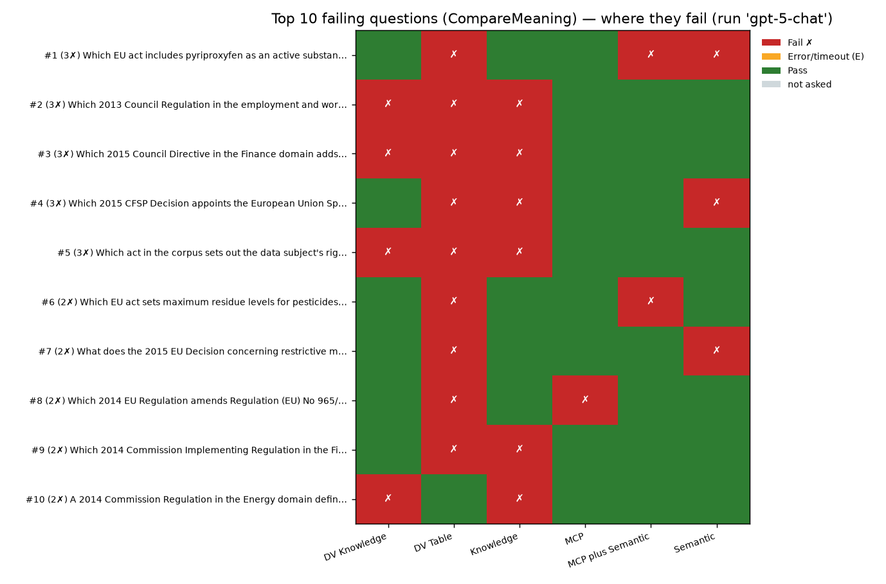

---

## Claude Sonnet 4.6

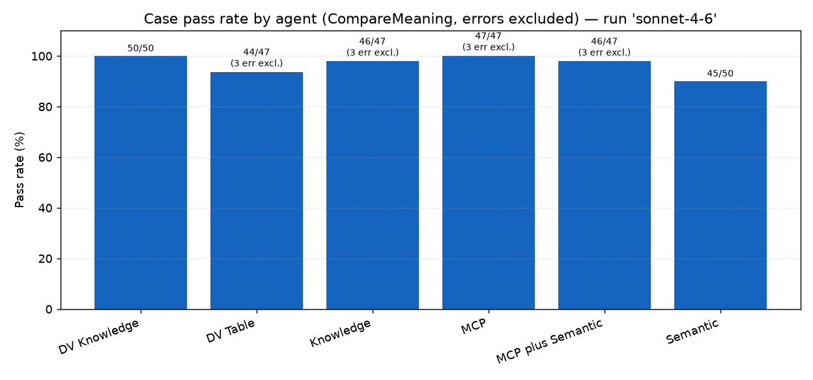

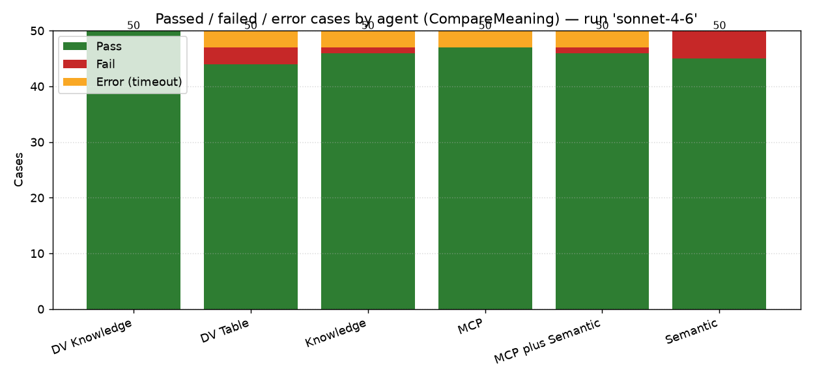

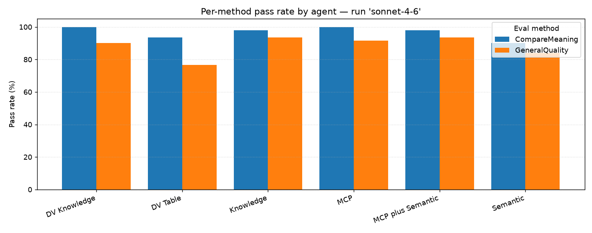

| Agent             | Cases | Passed | Failed | Errors |     CompareMeaning |    GeneralQuality |
| ----------------- | ----: | -----: | -----: | -----: | -----------------: | ----------------: |
| DV Knowledge      |    50 |     50 |      0 |      0 |     100.0% (50/50) |     90.0% (45/50) |
| DV Table          |    50 |     44 |      3 |      3 |  93.6% (44/47) +3E | 76.6% (36/47) +3E |
| Knowledge         |    50 |     46 |      1 |      3 |  97.9% (46/47) +3E | 93.6% (44/47) +3E |
| MCP               |    50 |     47 |      0 |      3 | 100.0% (47/47) +3E | 91.5% (43/47) +3E |
| MCP plus Semantic |    50 |     46 |      1 |      3 |  97.9% (46/47) +3E | 93.6% (44/47) +3E |
| Semantic          |    50 |     45 |      5 |      0 |      90.0% (45/50) |     84.0% (42/50) |

Sonnet 4.6 produces the strongest overall result set. DV Knowledge and MCP both
reach 100.0% over their scored cases, and Knowledge plus MCP plus Semantic are
within one failure of perfect. Semantic remains the lowest scored pass rate, but
still reaches 90.0%.

The main caveat is reliability: four methods have three errors each. Because
errors are excluded from the denominator, MCP's 100.0% is 47/47 rather than
50/50, and DV Table's 93.6% is 44/47 plus three error cases.

The Sonnet failing-question heatmap is much sparser than the GPT heatmaps. The
data-subject erasure question is still the only row failed by more than one
agent. Two rows are primarily error rows rather than failure rows.

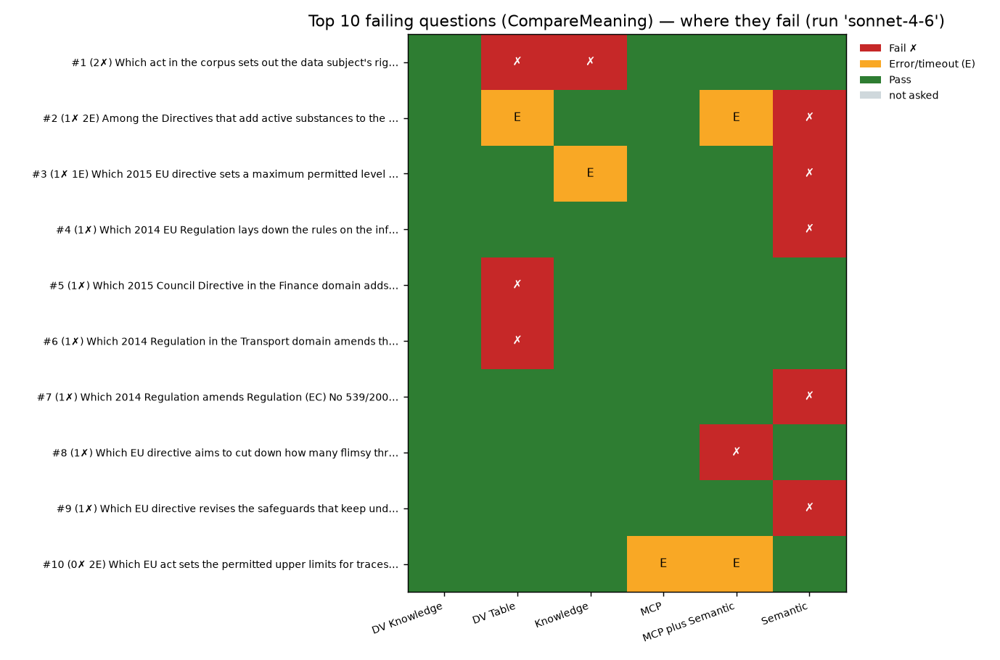

---

## Discussion

### Retrieval and Model Interact

The evaluation does not identify a single retrieval method that dominates every
model. DV Knowledge is best on GPT-4.1, MCP is best on GPT-5 Chat, and Sonnet
4.6 makes several approaches look excellent. This matters operationally: an
agent architecture selected under one model can change rank under another.

The safest interpretation is that retrieval method should be validated with the
actual target model. Model upgrades can hide retrieval weaknesses, while model
downgrades can expose them sharply.

### Structured Retrieval Is the Strongest Tool-Based Default

MCP improves from 76.0% on GPT-4.1 to 96.0% on GPT-5 Chat and 100.0% over scored
Sonnet cases. The method is especially well matched to this corpus because many
questions carry structured cues: year, document type, policy domain, named act,
date, or regulation number.

The hybrid method is also strong, but it does not consistently beat MCP. It
adds a Dataverse semantic-search tool leg, which can help with paraphrase-heavy
questions, but it also adds execution cost and, in the Sonnet run, shares the
three-error profile seen in several configurations.

### Knowledge Granularity Matters

The same corpus behaves very differently depending on how it is presented to
Copilot Studio knowledge grounding:

| Knowledge-style method                        | GPT-4.1 | GPT-5 Chat | Sonnet 4.6 |
| --------------------------------------------- | ------: | ---------: | ---------: |
| One uploaded file per document (DV Knowledge) |   96.0% |      90.0% |     100.0% |
| Whole corpus as one uploaded CSV (Knowledge)  |   84.0% |      68.0% |  97.9% +3E |
| Native Dataverse table knowledge (DV Table)   |   60.0% |      58.0% |  93.6% +3E |

Per-document upload is the most reliable knowledge-source shape across the
three runs. Whole-corpus upload and native table knowledge appear more sensitive
to model choice and more prone to lower quality on the GPT runs.

### Dataverse Semantic Search Tool Is Useful but Not Sufficient Alone

The Semantic agent uses Dataverse semantic search via a Copilot Studio tool. It
is relatively stable: 74.0%, 76.0%, and 90.0%. It benefits from the stronger
Sonnet model, but it does not lead any run. On this dataset, many hard questions
require exact disambiguation among similar legal acts, which favours structured
metadata filters and exact terms over semantic similarity alone.

### Error Handling Changes the Reading of Near-Perfect Scores

Errors are excluded from the pass-rate denominator to avoid treating an empty
response as a graded wrong answer. That is appropriate for the headline metric,
but error counts still matter for production readiness. A method with 100.0% on
47 scored cases and three timeouts is not operationally equivalent to 100.0% on
50 scored cases.

---

## Recommendations

1. **Default to MCP for metadata-rich Dataverse-backed corpora.** It is the
   strongest GPT-5 Chat method and reaches perfect scored accuracy under Sonnet
   4.6. Its structured filters align well with legal corpora where year,
   domain, document type, and act identifiers are decisive.

2. **Use MCP plus Semantic when recall is more important than latency.** The
   hybrid method is a good robustness option when questions may be phrased in
   paraphrases or when missing a relevant document is costlier than running both
   the MCP path and the Dataverse semantic-search tool path.

3. **For knowledge grounding, upload one file per document.** DV Knowledge is
   the strongest knowledge-source option in every run. Avoid using one large CSV
   as the primary knowledge object unless the operational simplicity is worth
   the accuracy trade-off.

4. **Treat native Dataverse table knowledge as a fallback.** DV Table is last on
   both GPT runs and has errors under Sonnet 4.6. It may be convenient, but it
   should be evaluated carefully before production use.

5. **Keep model selection in the retrieval decision.** Sonnet 4.6 compresses the
   spread across retrieval methods, while GPT-4.1 and GPT-5 Chat expose larger
   differences. Re-run the evaluation when changing the model behind an agent.

6. **Track failures and errors separately.** CompareMeaning pass rate is the
   right headline retrieval metric, but timeout and empty-response counts should
   be reviewed alongside it for operational readiness.

7. **Use the tiered question set to diagnose weaknesses.** Tier C and D expose
   exact legal disambiguation failures; Tier E checks abstention; Tier S checks
   paraphrase retrieval. Looking only at the aggregate score hides which
   capability is failing.

---

## Reproducibility Notes

The generated static analysis report is in `data/eval/analysis/report.md`. It
was generated from `data/eval/results` and includes the per-run summary tables
and failing-question matrices used here.

The charts embedded in this report are generated artifacts in
`data/eval/analysis/charts/`:

- `passrate_across_runs.png`
- `passrate_by_agent__gpt-4-1.png`
- `passrate_by_agent__gpt-5-chat.png`
- `passrate_by_agent__sonnet-4-6.png`
- `passfail_stacked__gpt-4-1.png`
- `passfail_stacked__gpt-5-chat.png`
- `passfail_stacked__sonnet-4-6.png`
- `method_passrate__gpt-4-1.png`
- `method_passrate__gpt-5-chat.png`
- `method_passrate__sonnet-4-6.png`
- `top_failures__gpt-4-1.png`
- `top_failures__gpt-5-chat.png`
- `top_failures__sonnet-4-6.png`
